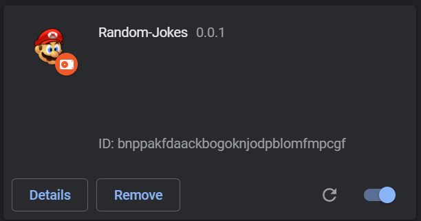

# Random-Joke-Chrome-Extension

A simple chrome extension that shows a random joke every time you click

## Use Extension

Download the repo as zip and extract it into a file. Then open Chrome Browser and go to Extension > Manage Extension and enable ```Developer Mode``` at the right corner. Then click ``` Load unpacked ``` and browse the folder you extracted the repo and open that specific folder and u can see the extension ``` Random-Jokes ``` in the list like below image -



Now when you will click the extension every time it will show some Random Joke.

## Contributing
Pull requests are welcome. For major changes, please open an issue first to discuss what you would like to change.

